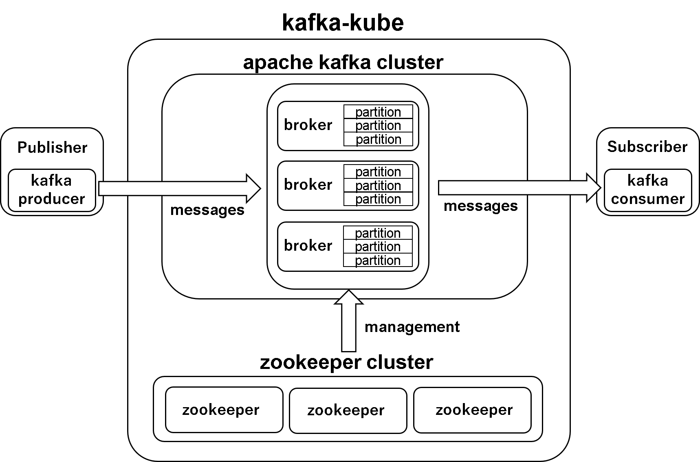

# kafka-kube
kafka-kubeはk8s上に構築されたkafkaとzookeeperによって構築された分散メッセージキューサービスです。
kafka-kubeでは、複数のサービス間でのデータの受け渡しを仲介するミドルウェアであるkafkaと、分散システムの設定共有やグルーピングをサポートするコーディネーションエンジンであるzookeeperの組み合わせによって、高負荷環境においても安定して分散システムを運用することを可能にします。
# 概要
kafka-kubeは複数のマイクロサービスに対してメッセージキューサービスを提供し、サービス間のpub/subを実現します。
publisherによって送信されたrecordはbrokerに送信され、対応するpartitionに格納されます。zookeeperはこのbroker間の連携に利用され、leader brokerの選出を行います。  
このように、partition単位でrecordの書き込み/読み込みを行うことによって、subscriberは並列な書き込み/読み込みを行うことが可能になります。  
kafka-kubeは、冗長性を確保するため、kafka 3台、zookeeper3台によって構成されています。

# gcpとedgeのハイブリッド環境構築手順
- [gcp構築手順](documents/gcp.md)
- [openvpn構築手順](documents/openvpn.md)
- [k8s構築手順](documents/buildk8s.md)

# 動作環境
kafka-kubeはkubernetes上での動作を前提としています。
```
OS: Linux
CPU: Intel64/AMD64 (armは現在未対応)
Kubernetes

最低限スペック
CPU: 2 core
memory: 4 GB

```

# 起動方法
このリポジトリをクローンし、makeコマンドを用いてサービスを起動してください。
```shell
$ cd /path/to/kafka-kube

#起動
$ make start-all

#停止
$ make delete-all
```

# Input  
publisherから送信されたメッセージ。データベースからの通知や、アプリケーションログ等をメッセージとして使用することができます。
# Output  
brokerに送られたメッセージ。consumerはtopicとpartitionを指定することでメッセージを利用することができます。


# アクセス方法
```shell
# k8sのcluster内ではkafkaのproducer,consumerのclient sdkを使って下記のエンドポイントに対して通信
kafka-${BROKER_NUMBER}.kafka-service.default.svc.cluster.local:9092
```
# システム構造


# 使用したdocker image
```markdown
### kafka image
- https://hub.docker.com/r/wurstmeister/kafka/
### zookeeper image
- https://hub.docker.com/_/zookeeper
```

