**目次** . 
* [gcpの構築手順](#gcpの構築手順)  
  * [インスタンスの構築手順](#インスタンスの構築手順)  
    * [step1 インスタンス作成](#step1-インスタンス作成)  
    * [step2 インスタンス作成画面を起動](#step2-インスタンス作成画面を起動)  
    * [step3 スペック選択](#step3-スペック選択)  
    * [step4 os選択,http通信許可 ](#step4-os選択,http通信許可 )  
    * [step5 ネットワーク画面設定画面を開く](#step5-ネットワーク画面設定画面を開く)  
    * [step6 静的グローバルアドレスを予約](#step6-静的グローバルアドレスを予約)  
    * [step7 設定を確定](#step7-設定を確定)  
  * [ファイアウォールの設定](#ファイアウォールの設定)  
    * [step1 ファイアウォール画面を開く](#step1-ファイアウォール画面を開く)  
    * [step2 全default ルールの確認し、変更させる](#step2-全default-ルールの確認し、変更させる)  
    * [step3 step2の実行方法](#step3-step2の実行方法)  
    * [step4 新規ファイルウォールルール](#step4-新規ファイルウォールルール)  
    * [step5 開通ポート番号を指定](#step5-開通ポート番号を指定)  


# gcpの構築手順

## インスタンスの構築手順

### step1 インスタンス作成
  1. メニュー開く  
  2. Compute Engineクリック
  3. vmインスタンスクリック  
    
  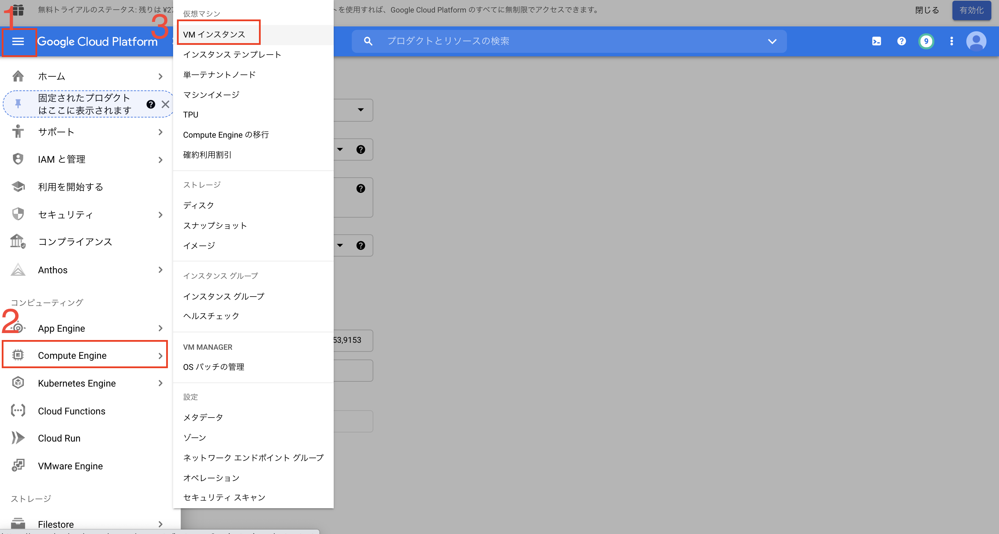
   

### step2 インスタンス作成画面を起動  
  1. インスタンス作成ボタンクリック  

   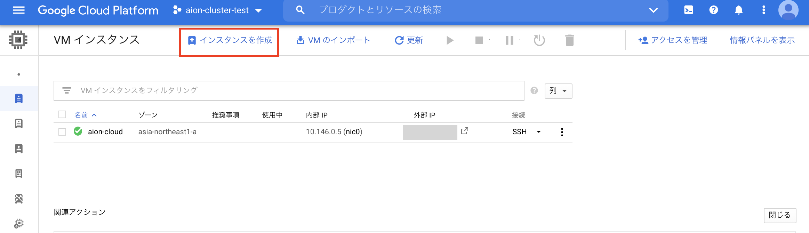  
   

### step3 スペック選択
   1. インスタンスの名前記述
   2. リージョンを選択 asia-northeast1 asia-northeast1-a
   3. スペックを選択  汎用-E2-e2-medium (2 vCPU,4GB　メモリ)  
    
  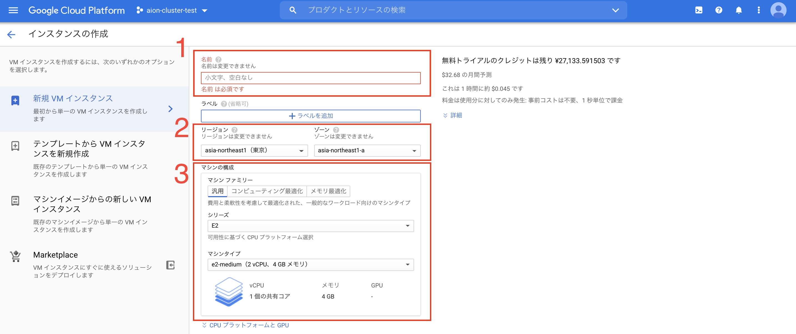
     
### step4 os選択,http通信許可 
   1. OSをUbuntu 18.04 LTSに選択
   2. ファイアウォールのhttp,httpsを許可させる

  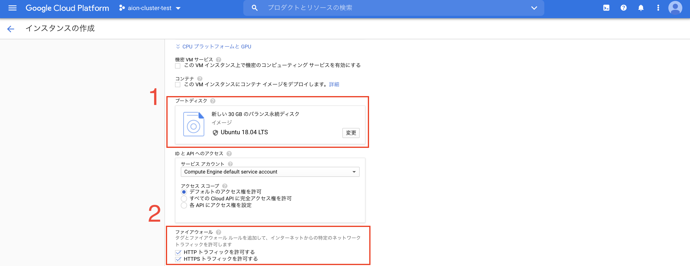

### step5 ネットワーク画面設定画面を開く
  1. ネットワークのタグを作成
  2. グローバルIPの予約画面を開く

  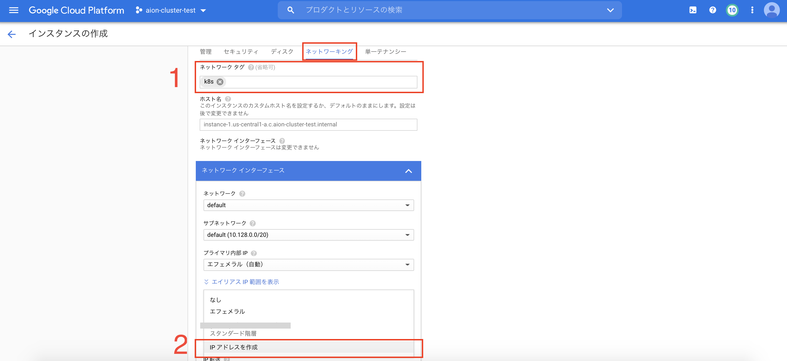  


### step6 静的グローバルアドレスを予約
  1. 名前記述（自由
  2. 標準を選択 (プレミアムでも可
    
   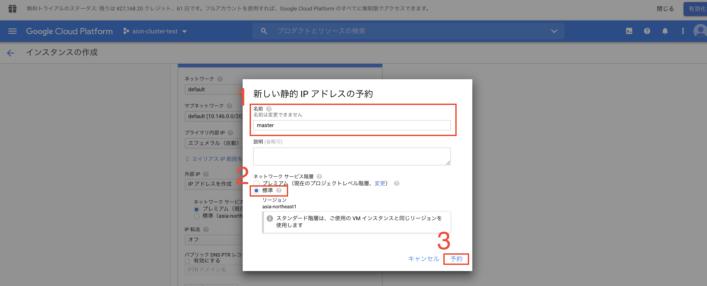

### step7 設定を確定
  1. グローバルIPを確認
  2. ネットワークの設定を完了し確定
  3. インスタンスを作成
  
  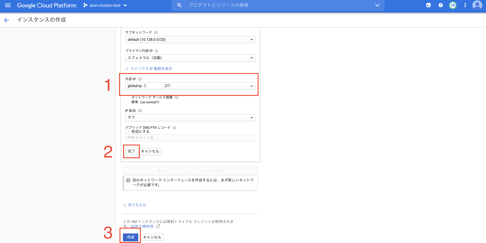


## ファイアウォールの設定

### step1 ファイアウォール画面を開く
  1. VPCネットワークをクリック
  2. ファイアウォール設定画面を開く
  
  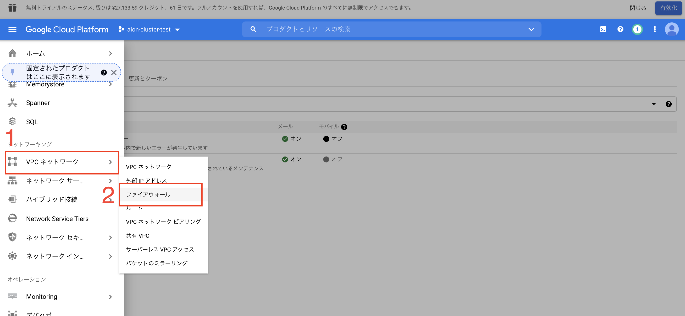


### step2 全default ルールの確認し、変更させる
  1. 全てのインスタンスに適用するようにに変更
  2. フィルタをedgeが存在するネットワークのグローバルIPに限定する
  
  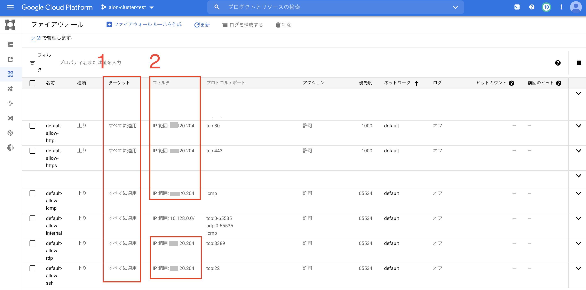


### step3 step2の実行方法
  0. defaultルールをクリックし、編集画面を開く
  1. ターゲットを「ネットワーク上の全てのインスタンス」に変更
  2. ソースIPの範囲をedgeのグローバルIPに限定　例: 8.8.8.8/32
  3. 保存します
  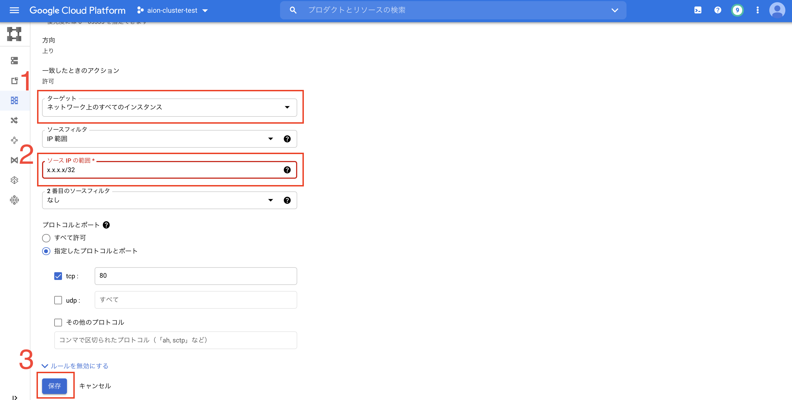


### step4 新規ファイルウォールルール
  0. ファイルウォール画面にて「新規ファイルウォールルールを作成」ボタンクリック
  1. ターゲットを「ネットワーク上の全てのインスタンス」に変更
  2. ソースIPの範囲をedgeのグローバルIPに限定　例: 8.8.8.8/32

  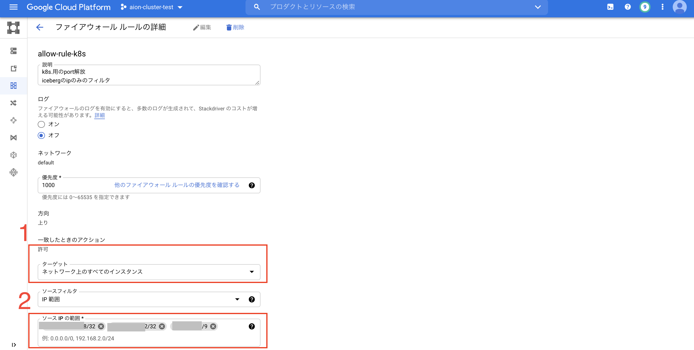

### step5 開通ポート番号を指定
  1. プロトコルとポートを指定:
  ```text
  tcp:6443
  tcp:2379-2380
  tcp:10250
  tcp:10251
  tcp:10252
  tcp:10250
  tc:53,9153
  udp:53
  ```
  2. 保存します。
  
  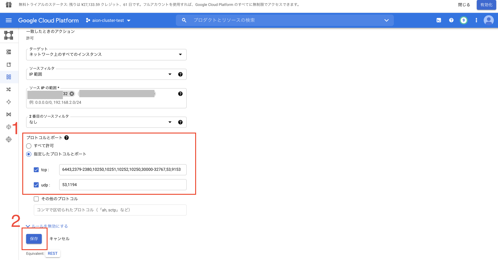  

## GCEの構築は以上で終了
